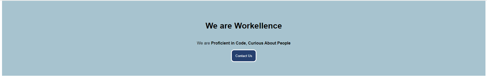

# Module 5 - CSS Best Practices

## Introduction

CSS is powerful and flexible language to help you **style an HTML** document. Even though you use CSS on a daily basis, there are **conventions and best practices** to help you write more **efficient and maintainable styles**.

[Learning Materials About This Topic](https://www.notion.so/mkit/CSS-Best-Practices-d65051b2bc3f407cabfbc6384fa6c8d3)

_Pro Tip: You are provided with an `index.html` file. In this module you have to style the whole page until it covers all requirements. You do not have to edit the HTML file, you only have to write the CSS._

## Exercise #1 - Style Navbar

In this Exercise you have to style the navbar of the page.

Your objectives are to:

- Position it on the top of the page even when you are scrolling.
- Set navbar should be with `width 100%`.
- Have background with color `#F5F5F5`.
- Set all text on the page to be with font family of `Arial, Helvetica, sans-serif`.
- Style navbar in this way that its content is pushed `24px` in horizontally and centered vertically.
  - Style navbar in this way that it have a solid border bottom with width of `1px` and color `#C5C5C5`.
  - Style nav links in this way that they have space between them of `32px`.
  - Style nav links in this way that they do not have any bullets
  - Set nav links font size to be `18px`.
- Set header title font size to be `32px`

Example:


## Exercise #2 - Specificity

In this Exercise you are provided with hero section, which is the first section in the page, and the styles written for this section in the head tag. The hero section consists a title, subtitle and a button.

Your objective are to:

- Overwrite the styles in the head by increasing the specificity for different elements so required styles are applied:
  - Change the `background` of the hero section from `red` to `#A7C3CF`
  - Increase the `font size` of the title with `22px` so the users can read it easily
  - Increase the width of the button with `50px`
  - Change the color of the button from `black` to `#253F6E`
  - Change the text color of the button from `black` to `white`
  - Increase the border radius of the button with `10px`




## Exercise #3 - Select Nested Elements

In this Exercise you are provided with `how-to-become-a-front-end-developer` unordered list, which is the second section in the page. The unordered list consists the steps you need to take in order to become a Front end developer.

Your objectives are to:

- Make all Learn HTML structure bullet points with text color `red`
- Make Learn specificity bullet point `yellow`
- Make Learn operators bullet point `blue`
- Make Learn regex bullet point `green`
- Make all Advance bullet points `violet`
- Make all Proficient bullet points `cyan`


## Exercise #4 - Use of BEM

In this Exercise you are provided with the `footer` and the styles for it. Every child element of the footer have a different class name, which does not satisfy the BEM convention.

_Pro Tip: You can modify only this section of the html file!_

Styles:

```css
.footer {
  position: fixed;
  bottom: 0;
  width: 100%;
  height: 50px;
  display: flex;
  justify-content: space-between;
  align-items: center;
  border-top: solid 1px #c5c5c5;
  background-color: white;
}

.copyright {
  margin-left: 24px;
  font-weight: 600;
  font-size: 14px;
}

.social-media {
  display: flex;
  flex-direction: row;
  gap: 32px;
  margin-right: 24px;
}

.platform {
  color: #777789;
}
```

Your objectives are to:

- Change every elements class name in order to satisfy BEM convention
- Change styles class names in order to satisfy BEM convention

_Pro Tip: This Exercise will be tested with css which satisfy BEM convention!_

Example:

```html
<div class="todo-list">
  <div class="todo-list__todo-item">
    <p class="todo-list__todo_item--chore">Sweep the floor</p>
  </div>

  <div class="todo-list__todo-item">
    <p class="todo-list__todo_item--chore">Wash the dishes</p>
  </div>

  <div class="todo-list__todo-item">
    <p class="todo-list__todo_item--chore">Netflix and Chill</p>
  </div>
</div>
```
