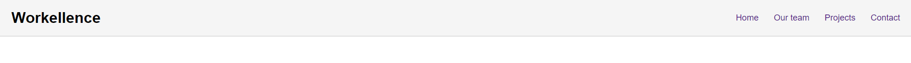

# Module 5 - CSS Best Practices

## Introduction

CSS is powerful and flexible language to help you **style an HTML** document. Even though you use CSS on a daily basis, there are **conventions and best practices** to help you write more **efficient and maintainable styles**.

[Learning Materials About This Topic](https://www.notion.so/mkit/CSS-Best-Practices-d65051b2bc3f407cabfbc6384fa6c8d3)

## You are provided with an `index.html` file. In this exercises you have to style the whole page until it covers all requirements. You **DO NOT** to edit the `html` file, you only have to write the css.

## Exercise #1 - Style Navbar

In this exercise you have to style the navbar of our page.

Your objectives are to:

- Position it on the top of the page even when you are scrolling.
- Set navbar should be with `width 100%`.
- Have background with color `#F5F5F5`.
- Set all text on the page to be with font family of `Arial, Helvetica, sans-serif`.
- Style navbar in this way that it's content is pushed `24px` in horizontally and centered vertically.
  - Style navbar in this way that it have a solid border bottom with width of `1px` and color `#C5C5C5`.
  - Style nav links in this way that they have space between them of `32px`.
  - Style nav links in this way that they do not have any bullets
  - Set nav links font size to be `18px`.
- Set header title font size to be `32px`

Example:

## Exercise #2 - Specificity

In this exercise you are provided with `hero section`, which is the first section in our page, and the styles written for this section in the head tag. The hero section consists a title, subtitle and a button.

Your objective is to:

- overwrite the styles in the head by increasing the specificity for different elements so required styles are applied:
  - Change the `background` of the hero section from `red` to `#A7C3CF`
  - Increase the `font size` of the title with `22px` so our users can read it easily
  - Increase the width of the button with `50px`
  - Change the color of the button from `black` to #253F6E`
  - Change the text color of the button from `black` to `white`
  - Increase the `border radius` of the button with `10px`

