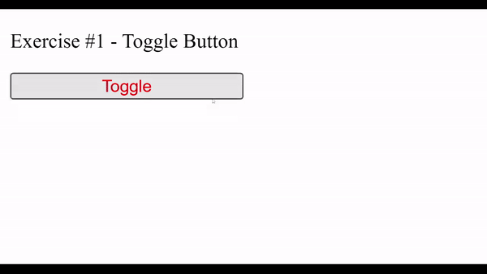
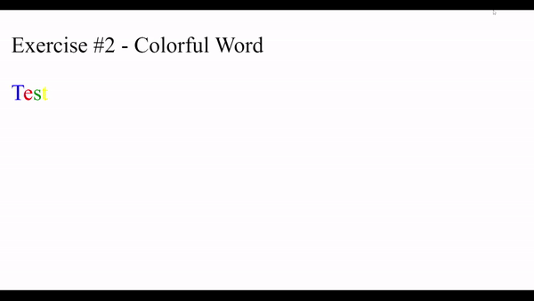
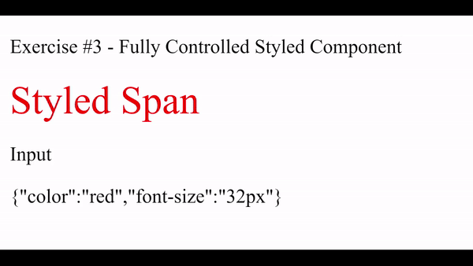
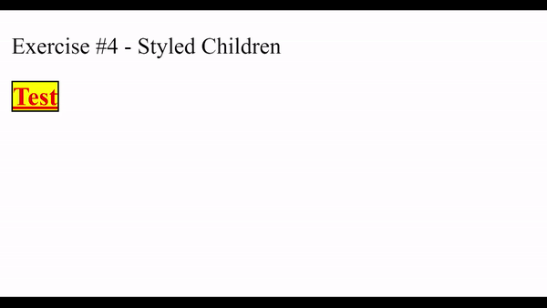
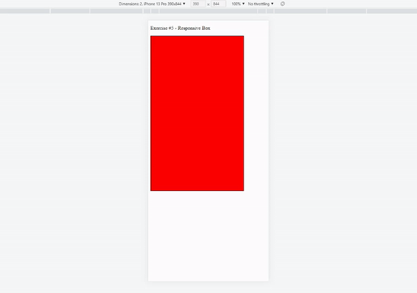

# Module 7 - CSS-in-JS

## Introduction

With the rise of component-based JavaScript frameworks and the lack of some essential CSS features a new approach for writing CSS emerged. CSS-in-JS is an approach or methodology to help you go around the limitations of CSS and help write more efficient and portable CSS.

[Learning Materials About This Topic](https://www.notion.so/mkit/CSS-in-JS-b87d2f5b2ef040d3bb55c7a536f87d75)

_Pro Tip: This topic will be tested in strict mode!_

## Exercise #1 - Toggle Button

In this Exercise you are provided with `Toggle` Functional component. It will receive a `isOn: boolean` prop as input and you can safely expect this input to be valid. It will contain one `Button` Component with text content `Toggle` with color of `red`.

Your objectives are to:

- Switch the color of the button depending on `isOn`
  - If `isOn` is true the color of the button should be blue
  - If `isOn` is false the color of the button should be red
- You should adjust the button's width from 100% to 50% upon click, and vice versa

Example:

_Pro Tip: Use Styled Components to style `Toggle`_

## Exercise #2 - Colorful Word

In this Exercise you are provided with `ColorfulWord` Functional React component. It will receive a `word: string` prop as input and you can safely expect this input to be valid. `word` will be from 1 to 6 characters long.

Your objectives are to:

- Color every character of `word` in different color depending on the number of the character in the `word` provided
- Display every character in a separate span with id in the following form `{ character } - { index }`
- If the index of the character is 0 the color should be blue
- If the index of the character is 1 the color should be red
- If the index of the character is 2 the color should be green
- If the index of the character is 3 the color should be yellow
- If the index of the character is 4 the color should be cyan
- If the index of the character is 5 the color should be violet

Example:

_Pro Tip: Use spans for every character and Styled Components to style the spans!_

## Exercise #3 - Fully Controlled Styled Component

In this Exercise you are provided with `StyledComponent` React Functional component. It will receive a `styles: CSSObject` prop as input and you can safely expect this input to be valid.

Your objectives are to:

- Display a `span`, created by styled components, with text content "Styled Span"
- Implement StyledComponent in this way it apply `styles` to the `span`

Example:

_Pro Tip: Use Styled Components to style the span!_

## Exercise #4 - Styled Children

In this Exercise you are provided with `StyledChildren` React Functional component. It will receive `children: React.Node` prop as input and you can safely expect this input to be valid. Children will be a `span` JavaScript XML (JSX) element.

Your objectives are to:

- Implement `StyledChildren` in a way that it set the color of `children` to red
- Implement `StyledChildren` in a way that it set the font size of `children` to "18px"
- Implement `StyledChildren` in a way that it set the font weight of `children` to bold
- Implement `StyledChildren` in a way that it set the text decoration of `children` to underline
- Implement `StyledChildren` in a way that it set the background color of `children` to yellow
- Implement `StyledChildren` in a way that it set the text border of `children` to be with 1px width, style of solid and color of black

Example:

_Pro Tip: Wrap `children` with a div and use Styles Components to style `children`!_

## Exercise #5 - Responsive Box

In this Exercise you are provided with `Box` React Functional component. It will not receive any props and you can safely expect to be tested with valid data. It should return a `StyledBox` component with id equals "styled-component".

Your objectives are to:

- Implement `StyledBox` to have border with 1px width, style of solid and color of black
- Implement `StyledBox` to have background color of red
- Implement `StyledBox` in way that it set it's height to "500px" if the screen dimensions are 390x844
- Implement `StyledBox` in way that it set it's width to "300px" if the screen dimensions are 390x844
- Implement `StyledBox` in way that it set it's height to "800px" if the screen dimensions are 768x1024
- Implement `StyledBox` in way that it set it's width to "500px" if the screen dimensions are 768x1024
- Implement `StyledBox` in way that it set it's height to "300px" if the screen dimensions are 1280x800
- Implement `StyledBox` in way that it set it's width to "800px" if the screen dimensions are 1280x800

Example:

_Pro Tip: Use Styled Components to style `StyledBox`!_
