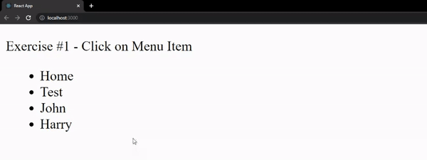
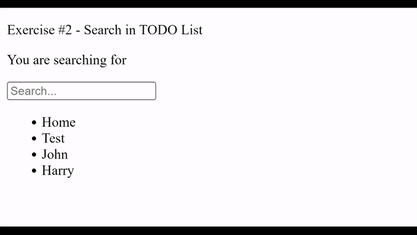
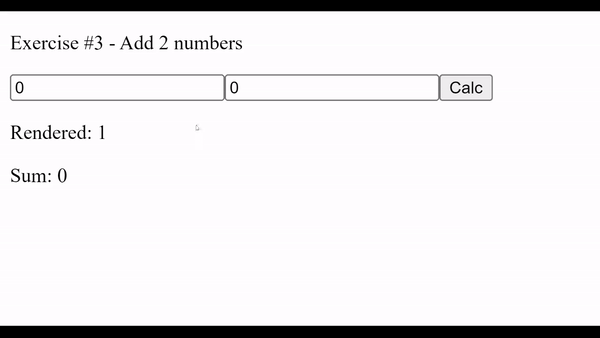
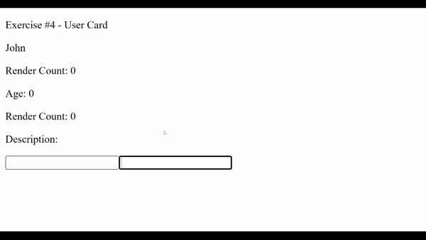

# Module 7 - React Components

## Introduction

As stated by the official **React** documentation, [**components** let you split the UI into independent, reusable pieces, and think about each piece in isolation.](https://reactjs.org/docs/components-and-props.html) There are two main types of **components** providing you with flexible features and granular control over the **component**'s behavior. Choose wisely.

[Learning Materials About This Topic](https://www.notion.so/mkit/React-Components-e89ca4fa11d74aac8f8f761876aa1b26)

_Pro Tip: This topic will be tested in strict mode!_

## Exercise #1 - Click on Menu Item

In this Exercise you are provided with `Menu` React Class component. It will receive `menuItems: string[]` as props and you can safely expect this input to be valid.

Your objectives are to:

- Display all elements in `menuItems` as list items
- Implement `Menu` in this way that an alert containing the text of the list item should popup when you click on a list item

Example:

## Exercise #2 - Search in TODO List

In this Exercise you are provided with `Search` React Functional component. It will receive `todoItems: string[]` as props and you can safely expect this input to be valid.

Your objectives are to:

- Display all elements in `todoItems` as list items
- Create an input above `todoItems`
  - Input should be of type `text` and with a placeholder of "Search..."
  - Implement Search in this way that it handles the input and displays its value right above the input in format "You are searching for { searchValue }"
  - Implement Search in this way that it filters `todoItems` and displays all items that match the search value
    - If search value does not match todo items should not change

Example:

## Exercise #3 - Add 2 Numbers

In this Exercise you are provided with `AddTwo` React Class component. It will not receive any props and you can safely expect to be tested with valid data.

Your objectives are to:

- Implement 2 inputs of type `number`
- Implement a button of type `button` with text `Calc`
  - Implement the button in a way that on click it adds the `a` and `b`
- Implement `Result` React Class component that accepts `sum` as props and renders a paragraph with the sum of `a` and `b` in format of `Sum: { sum }`
  - Count how many times `Result` has rendered and displays it in a paragraph in format of `Rendered: { renderCount }`
  - If `sum` has not changes `Result` should not render

Example:

## Exercise #4 - User Card

In this Exercise you are provided with `UserCard` React Function component. It will not receive any props and you can safely expect to be tested with valid data.

Your objectives are to:

- Implement a paragraph with id equals `name` and text content equals `Name: John`
- Implement `Age` React Functional component that accepts `age: number` as props and renders a paragraph with id equals "userAge" and text content equals `Age: { age }`
  - Count how many times `Age` has rendered and displays it in a paragraph, with id equals "ageRenderCount", in format of `Rendered: { renderCount }`
  - Implement `Age` in this way that it does not render if `age` does not change
- Implement `Description` React Functional component that accepts `description: string` as props and renders a paragraph with id equals "userDescription" and text content equals `Description: { description }`
  - Count how many times `Description` has rendered and displays it in a paragraph, with id equals "descriptionRenderCount", in format of `Rendered: { renderCount }`
  - Implement `Description` in this way that it does not render if `description` does not change
- Implement 2 inputs of type `text`
  - Implement the first input to be with id "age"
  - Implement the first input in this way that it changes `age` that is passed to `Age` React Function component
  - Implement the second input to be with id "description"
  - Implement the second input in this way that it changes `description` that is passed to `Description` React Function component

Example:

